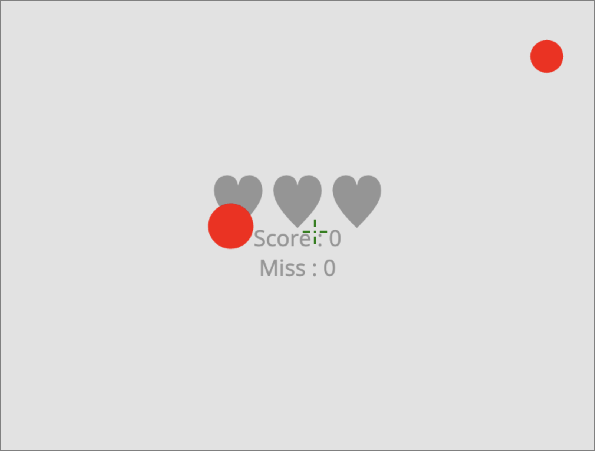
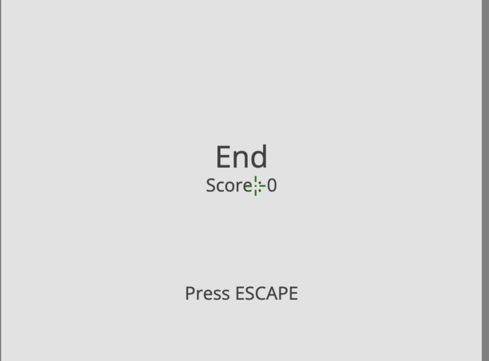

# Aim Trainer Game Document
## Dharmik Patel - GAME251 Final Project

**Introduction:**
    Welcome to the exciting world of precision and speed! The Aim Trainer Game is a cutting-edge experience designed to enhance your aiming skills and reflexes. Whether you're a seasoned gamer looking to sharpen your accuracy or a newcomer seeking an engaging introduction to aiming mechanics, this game is tailor-made for you.

**Motivation**
    The Aim Trainer Game was conceived with a clear purpose: to provide players with a fun and effective tool for improving their aiming abilities across various genres of games. In fast-paced gaming environments, precise aim is often the key to success. This game aims to bridge the gap between novice and expert players by offering a dynamic platform that challenges and refines your aiming skills. Since I primarily play First-Person Shooters, I thought this would most relate to me.

**Key Concepts**

- Drawing shapes in canas
- Animated Shapes
- On-Click input processing
- Game Loop until 3 lives
  
**Screenshots**

**Future**
    In the future I would like to impelement custom sensitivities, ability to change the speed of targets, allow moveable targets, changing environments, leaderboard.